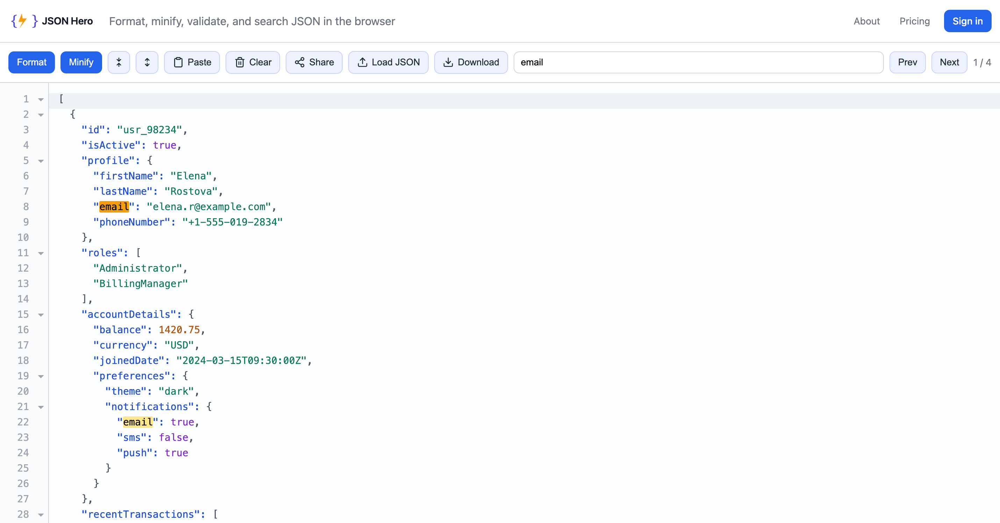

# jsonhero.dev

**A free online JSON viewer, formatter, validator and editor that runs in your browser.** 
Format, minify, validate and search JSON with no sign-up and no ads. 
Your JSON stays on your device unless you click Share.

### [Open the editor →][editor]

[Features][features] · [Pricing][pricing] · [FAQ][faq] · [Privacy](PRIVACY.md) · [Changelog](CHANGELOG.md)

 

## Features

- **Format and beautify.** Pretty-print with indentation and syntax highlighting, plus line numbers and bracket matching. Pasted JSON is formatted straight away, and a tolerant parser still gives you best-effort formatting when the JSON is malformed.
- **Validate.** Input is checked with `JSON.parse` when you format, and invalid JSON is flagged with a warning.
- **Minify.** Compact JSON to a single line.
- **Collapsible tree.** Fold any object or array, or collapse and expand everything in one click.
- **Search.** Real-time search with every match highlighted across the document.
- **Load JSON your way.** Paste it, drag and drop a `.json` file, or fetch it from a public URL that allows cross-origin requests (CORS).
- **Clipboard detection.** If the editor is empty when you open or return to the page, valid JSON on your clipboard is pasted in for you. Your browser may ask for permission first.
- **Extract JSON from logs.** Paste a log line or other text with JSON inside it, like `request: {…} response: {…}`, and the JSON is pulled out and formatted.
- **Unescape.** Escaped JSON strings like `{\"id\":1}` are detected and turned back into readable JSON.
- **Download.** Save the formatted or minified result as a text file.
- **Share links.** Send a teammate a short link like `jsonhero.dev/s/AbC123XyZ0` for any valid JSON. The link is copied for you, and you can add a name. See [how sharing works](#how-sharing-works).

Works in current versions of Chrome, Firefox, Safari and Edge.

### Keyboard shortcuts

| Shortcut | Action |
|---|---|
| <kbd>Ctrl/Cmd</kbd> + <kbd>Shift</kbd> + <kbd>M</kbd> | Minify |
| <kbd>Ctrl/Cmd</kbd> + <kbd>F</kbd> | Jump to the search box (replaces the browser's find) |
| <kbd>Enter</kbd> | Next search match |
| <kbd>Shift</kbd> + <kbd>Enter</kbd> or <kbd>Ctrl/Cmd</kbd> + <kbd>Enter</kbd> | Previous search match |
| <kbd>Esc</kbd> | Close a dialog or menu |

## Privacy

Formatting, minifying, validating, searching, folding, unescaping and downloading all run as JavaScript in your browser. None of them upload your JSON or send it to analytics.

**Share is the one exception.** It uploads the editor contents so the link has something to serve.

### How sharing works

- Anyone with the link can open it. Links aren't password-protected; their only protection is a random 10-character id.
- When a link is pasted into Slack, X, Discord or another app that unfurls links, the preview shows the start of your JSON.
- When someone opens a link, Google Analytics records the link, along with the share's name or, if it has none, a summary of its top-level keys.
- Shares are stored without your name or account, even when you're signed in.
- A link lasts 7 days on the free plan or 30 days on Pro. After that it stops working and the stored JSON is deleted.
- **Don't share credentials, access tokens or personal data.**

What's stored, what the analytics record, and how to check all of this yourself in DevTools: [PRIVACY.md](PRIVACY.md).

## Free and Pro

| | Free | Pro |
|---|---|---|
| Format, minify, validate, search, unescape | ✓ | ✓ |
| Document size | 100 KB | 1 MB |
| Share link lifetime | 7 days | 30 days |
| New share links | 30 an hour, 100 a day | 100 an hour, 500 a day |
| Support | Email | Priority email |
| Price | Free | ₹99/month or ₹999/year in India $4.99/month or $49/year elsewhere |

Prices include taxes, and Pro needs an account. The size limit covers pasting, opening a file, fetching a URL and sharing. A share link someone sent you opens on any plan, whatever its size.

## Feedback and support

- **Found a bug?** [Open a bug report](https://github.com/jsonherodev/jsonhero.dev/issues/new?template=bug_report.yml).
- **Have an idea?** [Request a feature](https://github.com/jsonherodev/jsonhero.dev/issues/new?template=feature_request.yml).
- **Security issue?** Please report it privately. See [SECURITY.md](SECURITY.md).
- **Account, billing, or removing a share link early?** Email [hello@jsonhero.dev](mailto:hello@jsonhero.dev).

Issues here are public, so please don't paste private JSON or share links you want to keep private.

## About this repository

This is the public home of jsonhero.dev: documentation, the changelog and the issue tracker. The app's source code is not published here.

If jsonhero.dev saves you time, starring this repo helps other developers find it.

---

jsonhero.dev is an independent project built and run by Akash Kumar.

[editor]: https://jsonhero.dev/?utm_source=github&utm_medium=referral&utm_campaign=repo&utm_content=readme
[features]: https://jsonhero.dev/features.html?utm_source=github&utm_medium=referral&utm_campaign=repo&utm_content=readme
[pricing]: https://jsonhero.dev/pricing.html?utm_source=github&utm_medium=referral&utm_campaign=repo&utm_content=readme
[faq]: https://jsonhero.dev/faq.html?utm_source=github&utm_medium=referral&utm_campaign=repo&utm_content=readme
